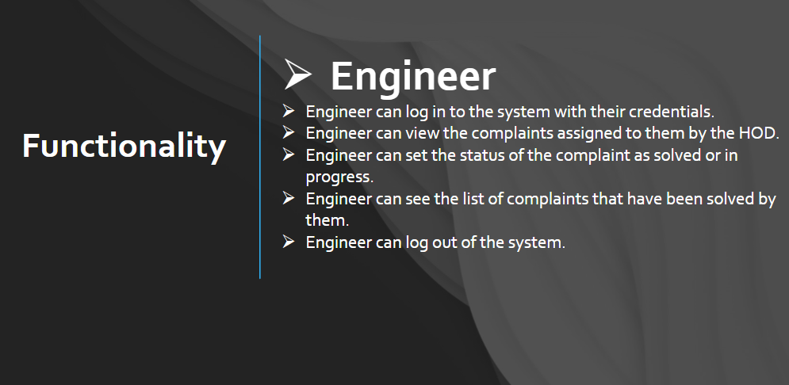

Online Tech Support
Online Hardware and Software Support System is an online platform that provides 24x7 access to the employees, engineers, Head of the Department, and administration. It helps keep your IT staff productive with fast, accurate, remote technical support for your System environment. The system provides defect support for a broad range of products running on System hardware.

Features
Accessible 24x7
Fast, accurate, remote technical support
Provides support for a broad range of products
User Roles
HOD
The HOD has the following roles in the system:

Login into the system
Register a new Engineer with a username(email) and password and the category (Hardware/software)
View the list of all registered Engineers
Delete any Engineers from the system
View all raised problems
Assign any problem to any Engineer
Engineer
The Engineer has the following roles in the system:

Login using their credentials given by the HOD
View the problem assigned to them by HOD
Update the status of the problem addressed by them (solved or in progress)
See the list of all problems attended by them
Change their password
Employee
The Employee has the following roles in the system:

Register themselves with a username and password
Login into the system
Register any complain (hardware/software) through the system
See the status of their problem by using complain ID
See all complain history raised by them
Change their password
About Project
Here are some images to give you a better idea of the project:

